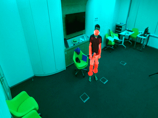
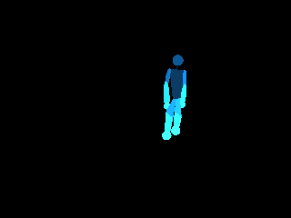
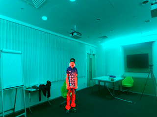
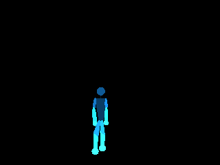

BodyPart Segmentation for "Chained Multi-stream Networks Exploiting Pose, Motion, and Appearance for Action Classification and Detection" in [ICCV 2017](http://openaccess.thecvf.com/content_ICCV_2017/papers/Zolfaghari_Chained_Multi-Stream_Networks_ICCV_2017_paper.pdf).

By Mohammadreza Zolfaghari, Gabriel L. Oliveira, Nima Sedaghat, Thomas Brox


### Requirements
1. Requirements for `Python`
2. Requirements for `Caffe` and `pycaffe` (see: [Caffe installation instructions](http://caffe.berkeleyvision.org/installation.html))

### Installation
1. Download caffe from [caffe_FAST](https://lmb.informatik.uni-freiburg.de/resources/binaries/PartSeg/caffe_FAST.tar.gz) or use caffe_FAST.zip provided in this repository.
2. Build Caffe and pycaffe

    ```Shell
    cd $caffe_FAST_ROOT/
    # Now follow the Caffe installation instructions here:
    # http://caffe.berkeleyvision.org/installation.html
    make all -j8 && make pycaffe
    ```

### Usage

*After successfully completing the [installation](#installation)*, you are ready to run all the following experiments.

#### Part 1: Create body pose maps (Test)
**Note:** In this part, we assume you installed caffe_FAST
1. Download the trained models for body part Segmentation using this command:

	```Shell
        python google_drive.py 1q3M8OWTc5v0pCkvxN7U9YWqGGsYopF3c /path_to_save/pose_models.zip
	```
    
2. Create body pose maps using create_pose_maps.py.
    -set the path of caffe, data list and save path in this script.
    This will create a body part map for each frame. 

#### Part 2: Train

1. Convert each body joint location to body part mask. We provided [sample code](https://github.com/mzolfaghari/chained-multistream-networks/tree/master/body_part_segmentation/create_body_mask) for NTU RGB+D dataset.

Image+mask             |  BodyPart mask
:-------------------------:|:-------------------------:
  |  
  |  

2. Train the model. (ToDo)


### Models

   Model file for pose: [Google Drive](https://drive.google.com/open?id=1q3M8OWTc5v0pCkvxN7U9YWqGGsYopF3c)


### Results (TODO)


### Project page
https://lmb.informatik.uni-freiburg.de/projects/action_chain/


### Contact

  [Mohammadreza Zolfaghari](https://github.com/mzolfaghari/chained-multistream-networks)

  Questions can also be left as issues in the repository. We will be happy to answer them.
